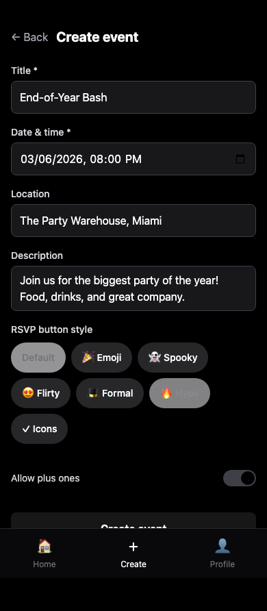
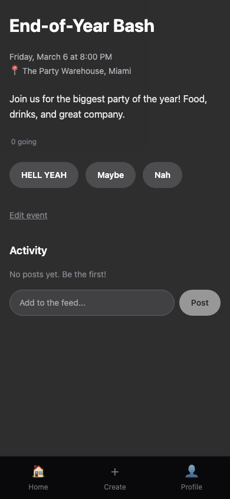
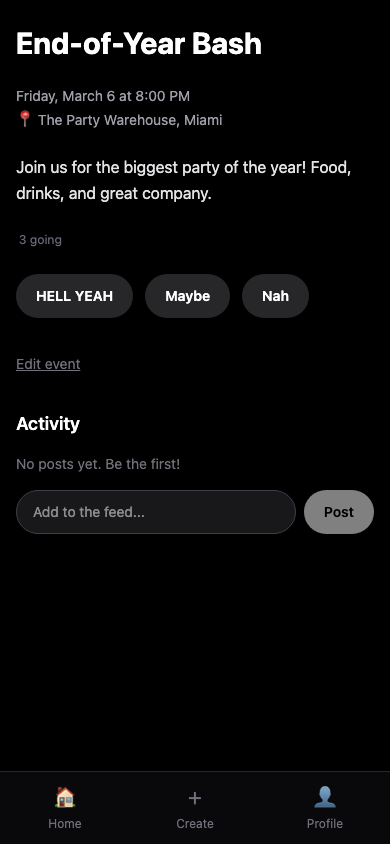
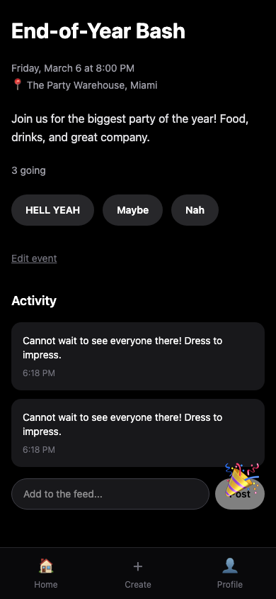

# partiful-claude

A [Partiful](https://partiful.com)-inspired event planning app — collaboratively designed and built by [@billiegoose](https://github.com/billiegoose) and [Claude Code](https://claude.ai/code) using the [superpowers](https://github.com/anthropics/claude-code) skill system.

## Features

- ✨ Create and share events via invite link
- 🎉 RSVP with customizable button styles (default, spooky 👻, flirty 😍, hype 🔥, formal 🎩, emoji, icons)
- 📡 Live RSVP count updates via Supabase Realtime
- 💬 Activity feed with posts and boops
- 🔗 Magic link auth — no passwords
- 📱 Mobile-first design

## Screenshots

> Auto-generated by the Playwright CI pipeline on every deploy. Run `npm run test:e2e` to regenerate locally.

| Home | Create Event | Event Page |
|------|-------------|------------|
|  |  |  |

| Live RSVPs rolling in | Activity feed with boop |
|----------------------|------------------------|
|  |  |

## Tech Stack

| Layer | Choice |
|---|---|
| Frontend | React 19 + Vite, TypeScript |
| Routing | React Router v7 (HashRouter) |
| Styling | Tailwind CSS v4 + shadcn/ui |
| Animations | Framer Motion |
| Backend | Supabase (Auth, Postgres, Realtime, Storage) |
| Hosting | GitHub Pages |
| CI/CD | GitHub Actions |
| Testing | Vitest (unit) + Playwright (E2E) |

All infrastructure is free tier — no backend server required. All permissions enforced via Postgres Row Level Security.

## Development

```bash
cp .env.example .env.local
# Add your Supabase URL and anon key to .env.local

npm install
npm run dev          # start dev server
npm run test         # unit tests (Vitest, watch mode)
npm run test:run     # unit tests (single run)
npm run test:e2e     # E2E tests (Playwright, requires built app)
```

## Architecture

See [docs/plans/2026-03-04-architecture-design.md](docs/plans/2026-03-04-architecture-design.md) for full design decisions and rationale.

### Key patterns

- **No custom backend** — browser talks directly to Supabase
- **Typed SDK wrapper** — all data access via `src/sdk/`, never raw Supabase client in components
- **RLS enforced** — permissions live in Postgres policies, not application code
- **HashRouter** — required for GitHub Pages compatibility
